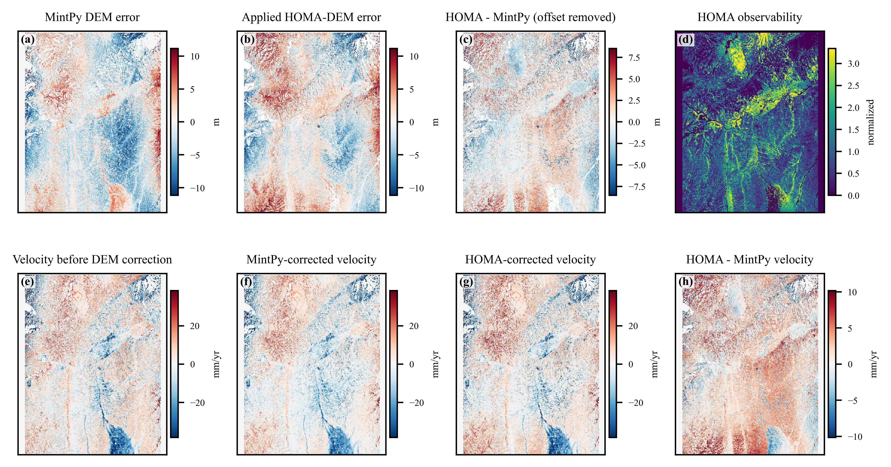
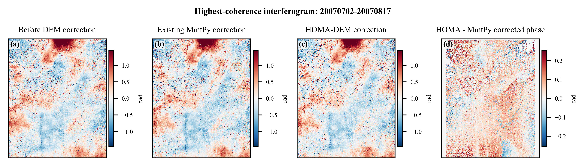
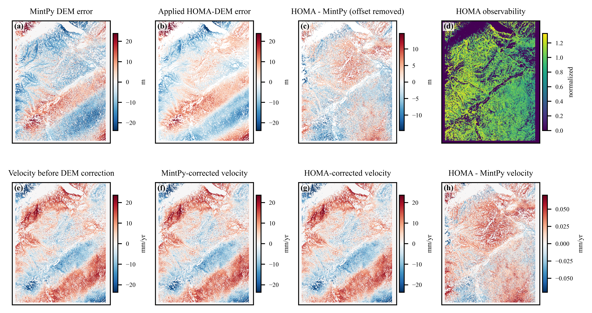
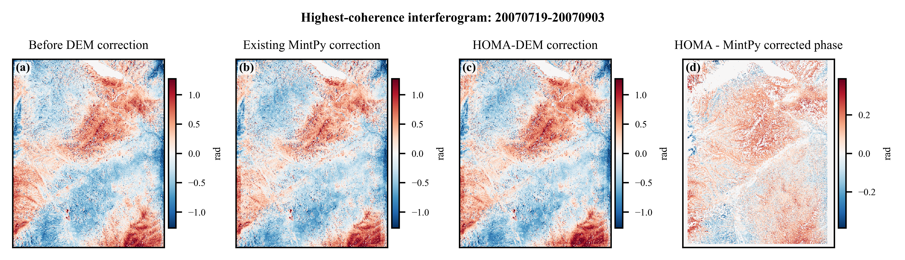

# HFT-473 and HFT-474 full-scene HOMA-DEM correction

## Processing profile

The two existing MintPy projects were reprocessed without modifying their original inputs. The full-scene profile uses:

- Adaptive HT, adaptive/linear Huber candidates;
- PGDC spatial support and uncertainty-aware graph regularization;
- a common DEM-error scale constrained to `[0, 1]` so the coherence-weighted full-stack residual cannot increase;
- 32-row core strips, 8-row overlap, and eight worker processes.

ICA, dynamic height, and IGS were disabled for this application. The real-data ablation did not support ICA on HFT473, the existing MintPy products assume static height, and wrapped-domain IGS is computationally infeasible for 4.9-6.0 million valid pixels. The products should therefore be described as the **validation-driven HOMA full-scene profile**, not as every HOMA branch running on every pixel.

## Reproduction

HFT-473:

```bash
python run_homa_full_scene.py \
  D:/WSL/ALOS/HFT-473/Mintpy/mintpy/inputs/ifgramStack.h5 \
  -g D:/WSL/ALOS/HFT-473/Mintpy/mintpy/inputs/geometryRadar.h5 \
  --mask D:/WSL/ALOS/HFT-473/Mintpy/mintpy/maskTempCoh.h5 \
  --mintpy-dem D:/WSL/ALOS/HFT-473/Mintpy/mintpy/demErr.h5 \
  --timeseries-before D:/WSL/ALOS/HFT-473/Mintpy/mintpy/timeseries_tropHgt.h5 \
  --timeseries-mintpy-corrected D:/WSL/ALOS/HFT-473/Mintpy/mintpy/timeseries_tropHgt_demErr.h5 \
  -o D:/WSL/ALOS/HFT-473/Mintpy/mintpy/homa_dem_correction \
  --block-rows 32 --halo-rows 8 --workers 8 --dpi 600 --overwrite
```

Replace `HFT-473` with `HFT-474` for the second track.

The standard MintPy velocity product was then generated from the new time series with the original project template:

```bash
/home/zdl/miniforge3/envs/SAR/bin/python -m mintpy.cli.timeseries2velocity \
  homa_dem_correction/timeseries_tropHgt_homaDem.h5 \
  --template smallbaselineApp.cfg \
  -o homa_dem_correction/velocity_homaDem.h5
```

Do not add `--save-res` while running from the original MintPy directory unless a separate residual output directory is arranged; MintPy otherwise writes `timeseriesResidual.h5` into the current directory.

## Outputs

Complete HDF5 products remain beside each MintPy project because they are too large for GitHub:

```text
HFT-47*/Mintpy/mintpy/homa_dem_correction/
  demComponent_homa_full_scene.h5
  ifgramStack_homaDem.h5
  timeseries_tropHgt_homaDem.h5
  velocity_homaDem.h5
  timeseriesResidual_homaDem.h5
  homa_full_scene_comparison.h5
```

`demComponent_homa_full_scene.h5` contains both `demErrorRaw` and the actually applied `demError`. The latter equals `global_scale * demErrorRaw`.

## Quantitative comparison

| Metric | HFT-473 | HFT-474 |
|---|---:|---:|
| Scene size | 3036 x 2484 | 3092 x 2476 |
| Valid mask pixels | 5,987,107 | 4,854,273 |
| Selected interferograms | 26 | 8 |
| Applied global DEM scale | 0.823 | 0.481 |
| Raw / applied HOMA DEM standard deviation | 5.24 / 4.31 m | 18.10 / 8.71 m |
| Coherence-weighted stack RMS before | 0.917 rad | 0.970 rad |
| Coherence-weighted stack RMS after | 0.822 rad | 0.873 rad |
| Weighted RMS reduction | 10.36% | 10.03% |
| Mean unweighted interferogram RMS before / after | 1.080 / 1.063 rad | 0.850 / 0.831 rad |
| Interferograms improved, unweighted | 21 / 26 | 2 / 8 |
| HOMA-MintPy DEM centered RMSE | 3.13 m | 5.90 m |
| HOMA-MintPy DEM centered MAE | 2.18 m | 4.47 m |
| HOMA-MintPy velocity RMSE | 3.75 mm/yr | 0.026 mm/yr |

The common scale reduces the weighted aggregate objective for both tracks. HFT-473 also improves most individual interferograms. HFT-474 is different: two long-baseline interferograms dominate the aggregate improvement while six of eight individual interferograms do not improve. Its eight interferograms form a sparse, multi-component temporal network, and the raw HOMA DEM amplitude is strongly overestimated. HFT-474 should be treated as a failure/limited-observability case rather than evidence that HOMA is generally superior.

## Figures

### HFT-473





### HFT-474





PDF and editable SVG versions, per-interferogram metrics, tile timings, and exact run summaries are stored under `full_scene_results/HFT473` and `full_scene_results/HFT474`.

## Interpretation limits

- The global scale is estimated in sample. It protects the aggregate weighted residual but is not a substitute for network holdout validation.
- HFT-474 requires additional interferograms connecting the isolated temporal components before its DEM map can be considered reliable.
- Lower phase RMS can absorb deformation, atmosphere, orbit, or unwrapping residuals. Independent elevation and held-out interferograms remain the primary validation criteria.
- The row-overlap strategy limits boundary effects, but full-scene graph regularization is approximated by overlapping strips rather than one global graph solve.

